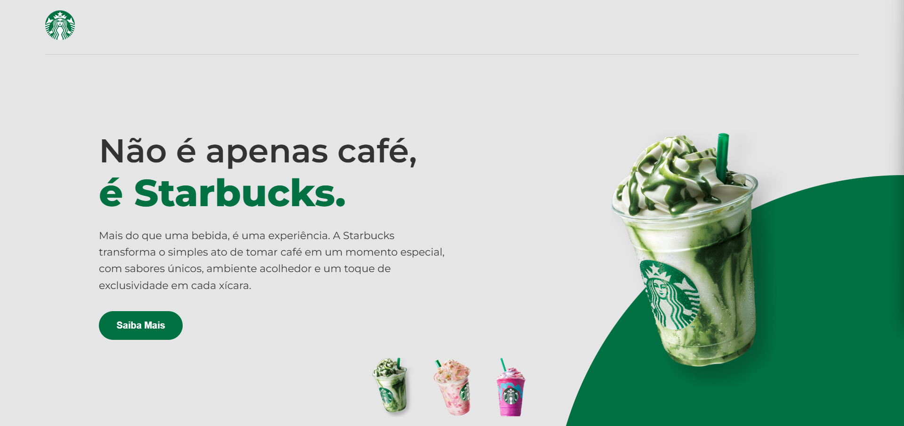

# ☕ Starbucks Landing Page Clone

Uma réplica moderna e responsiva da página inicial da Starbucks, desenvolvida com foco em UI/UX, animações suaves e responsividade.

---

## 🚀 Funcionalidades

- Layout responsivo (desktop, tablet e mobile)
- Efeitos de hover interativos
- Animações suaves no copo e nos botões
- Design fiel ao estilo Starbucks
- Troca de produtos ao clicar nas miniaturas
- HTML5 + CSS3 puro

---

## 📸 Demonstração

---

## 🛠️ Tecnologias Utilizadas

- HTML5
- CSS3
- Google Fonts (Montserrat, Roboto, Merienda etc.)
- Flexbox e Media Queries

---

## ✨ Layout

O design foi inspirado no visual moderno da Starbucks, com atenção especial aos detalhes visuais, cores institucionais e interações suaves.

---

## 📱 Responsividade

✔️ Telas grandes  
✔️ Tablets  
✔️ Smartphones

---

## 🧠 Aprendizados

- Flexbox para layouts adaptáveis
- Media queries para responsividade real
- Boas práticas com semântica HTML
- Transições CSS e transformações
- Uso de fontes externas via Google Fonts

---

## 📌 Status do Projeto

✅ Concluído — melhorias futuras podem incluir:
- Modo escuro
- Integração com API de produtos reais
- Animações com JavaScript

---

## 👨‍💻 Autor

Desenvolvido com 💜 por **Kássio Barros**  
[🔗 LinkedIn](https://www.linkedin.com/in/santosxis) | [💻 Portfólio](https://santosxis.github.io/portfolio-kassio/)
